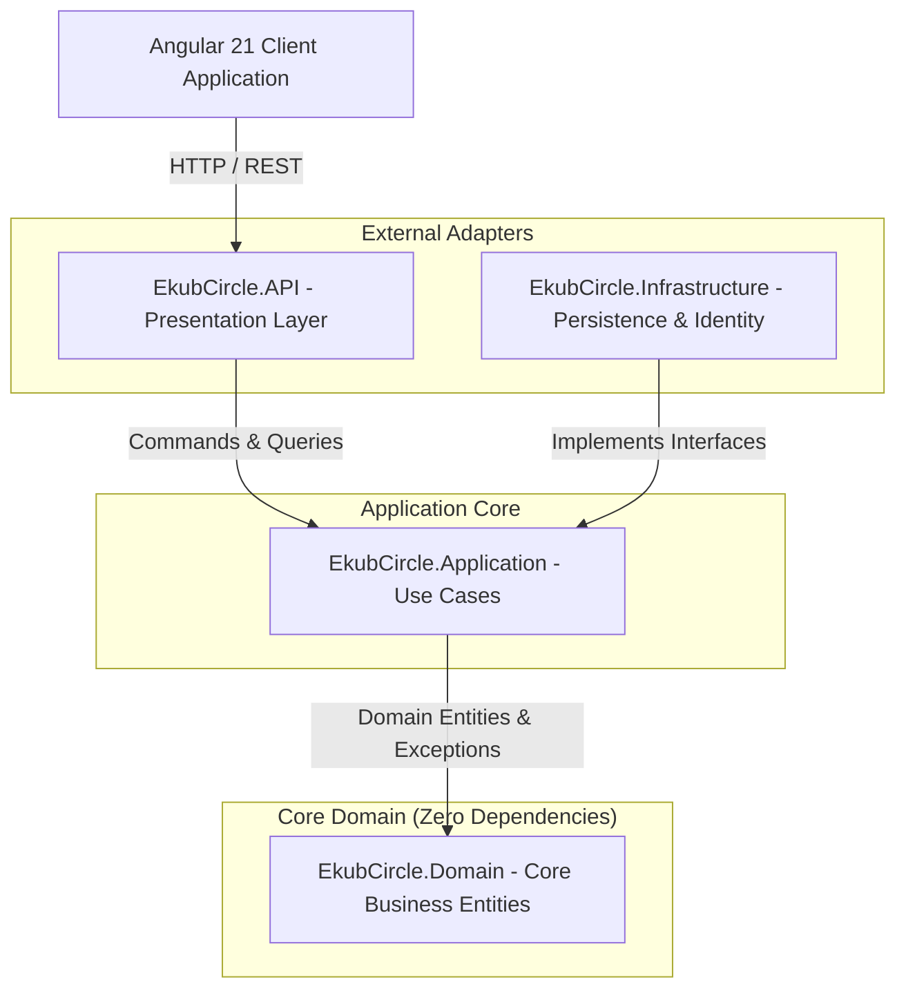
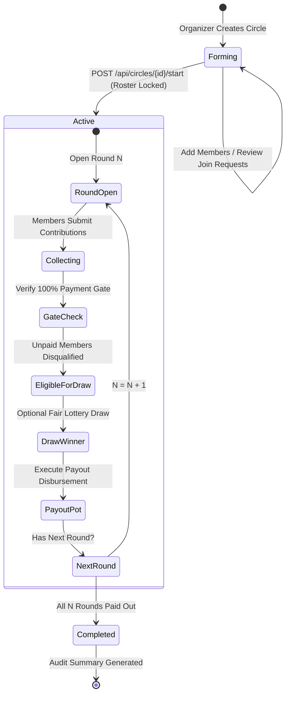

<div align="center">

# 🌟 EkubCircle (ዕቁብ)
### Next-Generation Rotating Savings & Credit Association (ROSCA) Digital Ledger

[](https://dotnet.microsoft.com/)
[](https://dotnet.microsoft.com/apps/aspnet)
[](https://angular.dev/)
[](https://www.typescriptlang.org/)
[](https://vitest.dev/)
[](https://playwright.dev/)
[](https://xunit.net/)
[](#-architecture--design-patterns)
[](LICENSE)

<br/>

**QIYAS Full-Stack Development Hackathon 2026 — Challenge 3: EkubCircle**

*Empowering community-driven financial solidarity through mathematical determinism, cryptographic fairness, and audit-grade immutability.*

[Quickstart](#-quickstart-guide) • [Architecture](#-architecture--design-patterns) • [Server Rules](#-enforced-business-rules) • [Testing Suite](#-testing-pyramid--verification) • [Screens](#-wireframe-coverage) • [API Docs](#-api-specification)

</div>

---

## 📖 Executive Summary

**Ekub (ዕቁብ)** is Ethiopia's centuries-old peer-to-peer rotating savings and credit system. Groups of trusted participants pool regular contributions into a central pot that is awarded to one member each cycle until everyone has received the pot once.

**EkubCircle** modernizes this cultural financial tradition into an enterprise-grade, audit-compliant digital platform. Built with **.NET 10 Onion Architecture**, **CQRS with MediatR**, **Entity Framework Core**, and **Angular 21 (Zoneless Signals)**, EkubCircle delivers 100% server-enforced integrity, real-time contribution tracking, cryptographically verified lottery draws, and complete transparency.

> [!NOTE]
> **Single Source of Truth**: All financial rules, contribution thresholds, member locks, and lottery eligibilities are rigorously enforced on the server side with composite database constraints and domain validations. The client UI acts purely as a reactive presentation layer.

---

## 👥 Hackathon Team & Project Info

| Attribute | Details |
|---|---|
| **Challenge** | Challenge 3 — EkubCircle Rotating Savings Ledger |
| **Hackathon** | QIYAS Full-Stack Development Hackathon 2026 |
| **Team Name** | EkubCircle Engineering Team |
| **Target Audience** | Ethiopian savings groups, informal credit circles, cooperatives, and diaspora communities |
| **Repository** | [github.com/Merdikai/EkubCircle-Real](https://github.com/Merdikai/EkubCircle-Real) |

---

## 🏛️ Architecture & Design Patterns

The solution is architected as an enterprise **Multi-Project Onion (Clean) Architecture**. Dependencies point strictly inward toward the core domain, ensuring complete decoupling from persistence, web frameworks, and third-party libraries.



### 📁 Directory Structure

```text
EkubCircle - Real/
├── backend/
│   ├── EkubCircle.sln
│   ├── src/
│   │   ├── EkubCircle.Domain/                  # Core Layer: Pure entities, enums, exceptions
│   │   │   ├── Entities/                       # User, Circle, CircleMember, Round, Payment, JoinRequest, Notification
│   │   │   ├── Enums/                          # UserRole, CircleStatus, CircleFrequency, RoundStatus, PaymentType
│   │   │   └── Exceptions/                     # DomainException, EkubRuleViolationException
│   │   ├── EkubCircle.Application/             # Use Cases Layer: CQRS commands, queries, validators, handlers
│   │   │   ├── Commands/                       # Auth, Circles, Payments, Rounds, JoinRequests, Notifications
│   │   │   ├── Queries/                        # Read models, summaries, audit lookups
│   │   │   ├── Handlers/                       # MediatR request handlers
│   │   │   ├── Common/Services/                # EkubCalculationService (pot totals, timeliness, lottery weights)
│   │   │   └── DTOs/                           # Data Transfer Objects & AutoMapper profiles
│   │   ├── EkubCircle.Infrastructure/          # Data Access & Identity Layer
│   │   │   ├── Persistence/Context/            # EkubDbContext (EF Core with SQLite & PostgreSQL support)
│   │   │   ├── Persistence/Configurations/     # Fluent API configurations with unique composite constraints
│   │   │   ├── Identity/                       # TokenService (HMAC-SHA256 JWT) & PasswordHasher (PBKDF2)
│   │   │   └── SeedData/                       # Deterministic database seeder (DbInitializer)
│   │   └── EkubCircle.API/                     # Presentation Web API: Thin controllers injecting only ISender & IMapper
│   │       ├── Controllers/                    # Auth, Circles, Rounds, Payments, JoinRequests, Notifications
│   │       ├── Middlewares/                    # Global ExceptionMiddleware (RFC 7807 ProblemDetails)
│   │       └── Program.cs                      # Composition Root & Swagger configuration
│   ├── tests/
│   │   └── EkubCircle.Tests/                   # Automated .NET 10 Test Suite (80 Tests)
│   │       ├── Unit/Services/                  # Pure calculation fact & theory boundary tests
│   │       ├── Unit/Handlers/                  # NSubstitute command handler isolation specs
│   │       ├── Integration/                    # WebApplicationFactory end-to-end API pipeline tests
│   │       └── Common/                         # CustomWebApplicationFactory with in-memory SQLite
│   └── test-api.ps1                            # 12-Suite Live API Verification Script
│
├── frontend/                                   # Modern Angular 21 Single-Page Application
│   ├── e2e/                                    # Full-Browser Playwright E2E Suite (6 Tests)
│   │   ├── auth.setup.ts                       # Shared storageState authentication setup
│   │   ├── circles-journey.spec.ts             # Dashboard & circles filter user journey
│   │   ├── resilience.spec.ts                  # API 500 error interception & recovery
│   │   └── accessibility.spec.ts               # WCAG 2.1 AA AxeBuilder accessibility audits
│   ├── src/
│   │   ├── app/
│   │   │   ├── core/                           # Guards, HTTP interceptors, services, models
│   │   │   ├── features/                       # Auth, Dashboard, Circles, Members, Rounds, Payments
│   │   │   ├── layout/                         # AppShell, Topbar, Sidebar, MobileNavigation
│   │   │   └── shared/                         # StatCard, ConfirmationModal, StatusBadge, Toast, Pipes
│   │   └── styles.css                          # Ethiopian cultural theme tokens & responsive styles
│   └── playwright.config.ts                    # Playwright multi-project runner configuration
└── README.md
```

---

## 🔒 Enforced Business Rules

EkubCircle operates under **7 Immutable Server-Side Rules** that guarantee financial fairness, tamper-proof audit trails, and strict operational integrity:

| # | Business Rule | Enforcement Mechanism | Failure Response |
|:---:|:---|:---|:---:|
| **1** | **Roster Lock on Start** | Circle members can only join or leave during `Forming` status. Starting the circle locks the roster permanently. | `HTTP 400 Bad Request` |
| **2** | **Deterministic Round Generation** | When a circle starts, exactly $N$ rounds are pre-generated for $N$ members with deterministic dates. | Database constraint & Handler |
| **3** | **One Winner per Round** | Each round allows exactly one winner/receiver. Multiple payouts for a single round are rejected. | `UNIQUE(CircleId, RoundNumber)` |
| **4** | **100% Contribution Gate** | A pot **cannot** be paid out until 100% of registered circle members have fulfilled their payment for that round. | `HTTP 400 Bad Request` |
| **5** | **Single Pot Receipt Rule** | A member can receive the pot at most once during a circle's complete lifecycle (`HasWon` / `HasReceived` flag). | `HTTP 400 Bad Request` |
| **6** | **Ongoing Payment Obligation** | Members who have already received their payout must continue contributing in all subsequent rounds. | Server validation engine |
| **7** | **Zero Duplicate Payments** | Composite index prevents members from paying multiple times for the same round. | `UNIQUE(RoundId, CircleMemberId, Type)` |

### 🔄 Circle Lifecycle State Machine



---

## 🌟 Innovation & Competitive Highlights

### 🎲 1. Cryptographically Fair Lottery Draw Simulator (`POST /api/rounds/{roundId}/draw`)
- Uses .NET `RandomNumberGenerator` for cryptographically secure, non-deterministic random selection.
- **Strict Ineligibility Filtering**: Unpaid members and members who have already won a pot in prior rounds are strictly disqualified from the candidate pool.
- Audit records store the candidate pool size, timestamp (`DrawnAt`), and winning member ID.

### 📊 2. Completed Circle Audit & Performance Summary (`GET /api/circles/{id}/summary`)
- Generates a full audit trail including total pot disbursed, rotation timelines, completed round counts, and individual member performance metrics (on-time vs. late payment ratio).

### ⏱️ 3. Payment Timeliness & Grace Period Classification
- Every contribution captures timestamp and an `IsLate` flag.
- Enables organizers to track member creditworthiness and financial reliability without punitive fee collection.

### ✉️ 4. Self-Service Join Requests & Organizer Approval Workflow
- Public/forming circles allow prospective members to submit join requests with custom introductory messages.
- Organizers review, accept, or decline requests. Acceptance automatically registers the member into the circle roster.

### 🔔 5. Real-Time In-App Audit Notifications
- Automated notifications dispatched upon payment confirmation, round payout advancement, invitation arrival, and status updates.

---

## 🧪 Testing Pyramid & Verification

EkubCircle features complete, multi-tiered test coverage across the full stack:

```
              ┌────────────────────────┐
              │     Playwright E2E     │  6 Tests (Full Browser Journeys & A11y)
              ├────────────────────────┤
              │      Vitest Specs      │  19 Tests (Angular Signals & HTTP Mocks)
              ├────────────────────────┤
              │ WebApplicationFactory  │  Integration Tests (.NET HTTP Pipeline)
              ├────────────────────────┤
              │  xUnit Unit & Theories │  80 Tests (Pure Domain & Handler Mocks)
              └────────────────────────┘
```

### 1. Backend Testing Suite (.NET 10 — 80 Tests, 100% Green)

The backend test suite adheres to the enterprise testing pyramid:

```powershell
dotnet test backend/EkubCircle.sln --no-build
```

- **Tier 1: Pure Domain Logic & Theory Tests (`EkubCalculationServiceTests.cs`)**:
  - Tests zero, negative, and large pot edge cases.
  - Parameterized `[Theory]` tests for timeliness (on-time, exact deadline boundary, within grace period, late).
  - Net payout deductions and lottery ticket weight distribution.
- **Tier 2: MediatR Handler Boundary Isolation**:
  - Validates command handlers using `NSubstitute` mocks, asserting exact `Received(1)` and `DidNotReceive()` interactions.
- **Tier 3: In-Memory Integration Server (`CustomWebApplicationFactory.cs`)**:
  - Boots ASP.NET Core with isolated in-memory SQLite and test JWT tokens.
  - Executes full HTTP pipeline tests against `Auth`, `Circles`, and `Rounds` endpoints.

### 2. Frontend Unit & Component Suite (Vitest — 19 Tests, 100% Green)

Runs modern Angular zoneless signal testing and HTTP client mock verifications:

```powershell
cd frontend
npm test
```

- **Signal Inputs & Reactive Rendering**: `StatCardComponent` and `ConfirmationModalComponent` testing `setInput()`, `whenStable()`, and output event subscriptions (`confirm`, `cancel`).
- **Router Isolation & Computed Signals**: `CirclesListComponent` with `provideRouter([])`, `circles` signal, `activeFilter` signal, and `filteredCircles` computed signal.
- **HTTP Mock Boundary**: `CircleService`, `PaymentService`, and `RoundService` with `provideHttpClientTesting()` and `HttpTestingController` asserting contract shapes, query params, and mutation payloads.

### 3. Frontend End-to-End & Accessibility Suite (Playwright — 6 Tests, 100% Green)

Runs real browser automation across multi-project setup with shared authentication:

```powershell
cd frontend
npx playwright test
```

- **Shared Auth Setup (`auth.setup.ts`)**: Reusable login storing session state to `playwright/.auth/user.json` to skip re-authentication in subsequent tests.
- **Happy-Path Journey (`circles-journey.spec.ts`)**: Validates authenticated dashboard rendering, circle navigation, and status filter switching (`All`, `Active`, `Forming`).
- **API Failure Resilience (`resilience.spec.ts`)**: Intercepts `/api/circles` with HTTP 500 (`ProblemDetails`) via `page.route` to ensure graceful error handling without client crash.
- **WCAG 2.1 AA Accessibility Audits (`accessibility.spec.ts`)**: Automated scans using `@axe-core/playwright` ensuring zero critical or serious accessibility violations.

### 4. Automated 12-Suite Live API Verification Script

A comprehensive end-to-end PowerShell script testing the running server across all business rules:

```powershell
powershell -ExecutionPolicy Bypass -File backend/test-api.ps1
```

---

## 👥 Seeded Demo Accounts (for Judges & Testing)

| Role | Email | Password | Full Name | Phone |
|:---|:---|:---|:---|:---|
| **System Admin** | `admin@hackathon.local` | `Admin123!` | Hackathon Admin | `+251911000000` |
| **Organizer** | `organizer@ekub.local` | `Ekub123!` | Abebe Bikila (Circle Organizer) | `+251911111111` |
| **Member 1** | `member1@ekub.local` | `Ekub123!` | Hana Girma | `+251911222222` |
| **Member 2** | `member2@ekub.local` | `Ekub123!` | Dawit Tadesse | `+251911333333` |
| **Member 3** | `member3@ekub.local` | `Ekub123!` | Meron Bekele | `+251911444444` |
| **Member 4** | `member4@ekub.local` | `Ekub123!` | Selam Fikre | `+251911555555` |

---

## 🚀 Quickstart Guide

### Prerequisites
- [.NET 9 / .NET 10 SDK](https://dotnet.microsoft.com/)
- [Node.js v20+ & npm](https://nodejs.org/)

### 1. Start the Backend API
```powershell
dotnet run --project backend/src/EkubCircle.API/EkubCircle.API.csproj --urls "http://localhost:5000"
```
- **API Base URL**: `http://localhost:5000`
- **Swagger Documentation**: `http://localhost:5000/swagger`

### 2. Start the Frontend Application
In a separate terminal:
```powershell
cd frontend
npm install
npm start
```
- **Web Application URL**: `http://localhost:4200`
- *(Requests to `/api` are automatically proxied to the backend on port 5000 via `proxy.conf.json`)*

### 3. Database Options (SQLite by Default)
- **Zero-Setup Default**: Uses local SQLite (`ekubcircle.db`), created and seeded automatically on first run.
- **PostgreSQL (Optional)**: Copy `backend/src/EkubCircle.API/appsettings.Development.example.json` to `appsettings.Development.json` and configure your connection string:
  ```json
  "ConnectionStrings": {
    "DefaultConnection": "Host=localhost;Port=5432;Database=ekubcircle_db;Username=postgres;Password=your_password_here"
  }
  ```
  *(Note: All credentials, passwords, and `.env` files are strictly excluded from git tracking by `.gitignore`)*.

---

## 📱 Wireframe Coverage

The frontend faithfully implements 100% of the challenge wireframes:

| Screen | Route | Purpose & Capabilities | Wireframe Alignment |
|:---|:---|:---|:---:|
| **Authentication** | `/login` | Sign-in and registration with 1-click persona quick-switcher for judges. | **Screen 1** |
| **Circle Creation** | `/circles/create` | Organizer sets circle name, contribution in Birr, and meeting frequency label. | **Screen 2** |
| **Forming Circle & Roster** | `/circles/:id/members` | Add members by email, review incoming requests, remove members during forming stage. | **Screen 3** |
| **Start Circle Modal** | `/circles/:id` | Irreversible confirmation: locks member list, fixes deterministic payout order, generates rounds. | **Screen 4** |
| **Join Requests & Invites** | `/join-requests` | Self-service membership requests and organizer invitation management. | **Screen 5** |
| **Member Home Ledger** | `/dashboard` | Primary dashboard: active round, current receiver, pot so far, **PAID/UNPAID** badge with 1-click contribution, and **YES/NO** pot receipt flag. | **Screen 6** |
| **Current Round Status** | `/circles/:id/round` | Live pot progress, member payment checklist, **Fair Draw Simulator**, and payout execution. | **Screens 7–10** |
| **Round & Winner History** | `/circles/:id/history` | Historical audit of member contributions, late payment indicators, and completed payout rounds. | **Screen 11** |
| **Audit Notifications** | `/notifications` | Live event audit trail of invitations, contributions, round starts, and pot disbursements. | **Screen 12** |
| **Completed Circle Summary** | `/circles/:id/summary` | Completed circle audit report displaying total pot disbursed, rotation history, and member metrics. | **Screen 13** |

---

## 📡 API Specification

### Authentication (`/api/auth`)
- `POST /api/auth/register` — Register a new account (Member / Organizer / Admin)
- `POST /api/auth/login` — Authenticate and receive an HMAC-SHA256 JWT Bearer token
- `GET /api/auth/me` — Retrieve current authenticated user profile

### Circles (`/api/circles`)
- `POST /api/circles` — Create a new circle (creator assigned as Organizer)
- `GET /api/circles` — List user's circles (`?status=draft|forming|active|completed`)
- `GET /api/circles/{id}` — Get circle details, members roster, and active round status
- `POST /api/circles/{id}/members` — Add member by email (Forming stage only)
- `DELETE /api/circles/{id}/members/{memberId}` — Remove member (Forming stage only)
- `POST /api/circles/{id}/start` — Lock roster, assign deterministic payout order, generate rounds
- `GET /api/circles/{id}/summary` — Completed-circle audit report and member metrics

### Rounds (`/api/rounds`)
- `GET /api/circles/{id}/rounds/current` — Current open round details, receiver info, member checklist, pot calculation
- `GET /api/circles/{id}/rounds` — List all rounds and payout statuses
- `POST /api/rounds/{roundId}/payout` — Execute pot payout (enforces 100% payment gate & single receipt rule)
- `POST /api/rounds/{roundId}/draw` — Cryptographically fair draw simulator (disqualifies unpaid members)

### Payments (`/api/payments`)
- `POST /api/payments` — Record member contribution (prevents duplicate payments, supports `IsLate` flag)
- `GET /api/payments?circleId={id}&roundId={id}` — Audit trail of contributions

### Join Requests (`/api/join-requests`)
- `POST /api/join-requests` — Submit request to join a circle or invite a user
- `PUT /api/join-requests/{id}/respond` — Accept or reject a join request (Organizer / Invitee)
- `GET /api/join-requests/circle/{circleId}` — Get all join requests for a circle
- `GET /api/join-requests/my` — Get all join requests sent or received by the current user

### Notifications (`/api/notifications`)
- `GET /api/notifications` — Get current user's notifications (`?unreadOnly=true|false`)
- `PUT /api/notifications/{id}/read` — Mark notification as read

---

## 📄 License & Attribution

This project is licensed under the **MIT License**. Developed for the **QIYAS Full-Stack Development Hackathon 2026** to showcase modern software engineering best practices applied to traditional Ethiopian community finance.